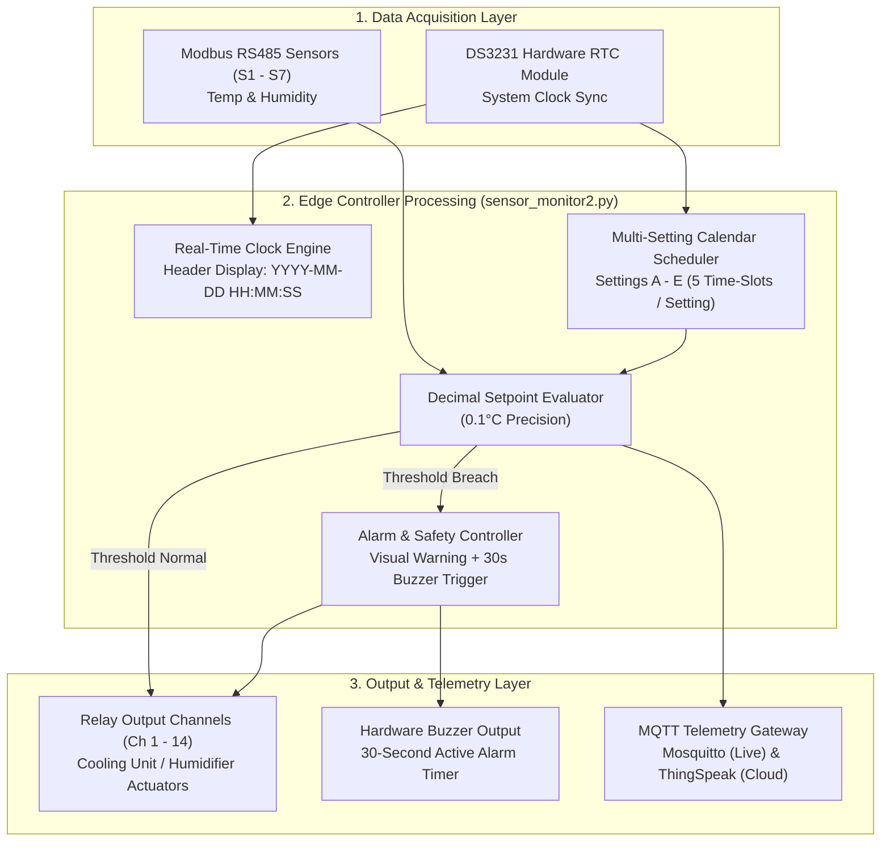

# Sensor Monitor 2 (`sensor_monitor2.py`) Analysis & Almora Image Feature Integration Plan


## System Engineering Architecture & Workflow



---

## 1. Executive Summary

This document provides a technical specification and implementation roadmap for `sensor_monitor2.py`, integrating the **Almora industrial controller requirements** into the edge monitoring framework.

---

## 2. Analysis of `sensor_monitor2.py`

### 2.1 Current Architecture Overview
`sensor_monitor2.py` is a Python-based edge controller and HMI application designed for cold storage and greenhouse monitoring (S1 to S7 sensors). Key components include:

1. **Sensor & Relay I/O Layer**:
   - **Modbus RTU Communication**: Reads temperature & humidity registers from 7 Modbus sensors (`S1` to `S7`) via USB RS485 adapters using `minimalmodbus`.
   - **Relay Channel Control**: Maps each sensor index to dual relay channels (1 for Cooling/Fan, 1 for Humidifier, total 14 channels) on fixed serial port `/dev/serial/by-path/usb-0:1:2:1:0-port0`.
2. **GUI Framework (Tkinter)**:
   - Fullscreen desktop UI with a 4-column dynamic grid showing live temperature and humidity for Cold Rooms 1-6 (`S1` to `S6`) and Green House (`S7`).
   - Color-coded sensor buttons: **Green** (Within setpoint range), **Red** (Beyond setpoints / Error / Offline).
   - Basic setpoint editing modal (`frame_set`) with numeric keypad for editing `T MIN`, `T MAX`, `H MIN`, and `H MAX`.
3. **Telemetry & Cloud Connectivity**:
   - **Mosquitto Private Broker (`147.93.106.142`)**: Transmits live JSON telemetry bursts for all 7 sensors and syncs setpoints bi-directionally with the web application (`inhydro/<DEVICE_NAME>/setpoints/...`).
   - **ThingSpeak Rotation**: Array-formatted field publishing for 7 sensors every 20 polling cycles.
   - **Offline Resilience**: Local JSON line logging (`local_logs/active.jsonl`) with automated backfill synchronization when connection is re-established.
4. **Provisioning**:
   - Background threads for Bluetooth RFCOMM connection and Wi-Fi provisioning via `nmcli`.

---

## 3. Analysis of the Handwritten Image Specs ("Almora")

The notebook page titled **"Almora"** specifies key functional requirements that extend `sensor_monitor2.py`:

```
===================================================================================
                                  ALMORA NOTES
===================================================================================
1) RTC (Real Time Clock) Integration
2) Display date and Time in screen
3) Temperature — Same humidity (Unified/correlated scheduling)
   - Settings A, B, C, D, E (Calendar / Date-bound profile presets: e.g. "21 July", "10 Sep")
   - Time Slot Schedule per Setting:
       * Start time 1  <-->  Stop time 2
       * time 3        <-->  time 4
       * time 5        <-->  time 6
       * time 7        <-->  time 8
       * time 9        <-->  time 10
4) Setpoint - Temperature in decimal (Support 0.1°C precision setpoints)
5) Set Point value display -> temp & humidity (Display target setpoint thresholds directly on the live dashboard widgets)
6) Warning notification beyond Set point (Visual warning alert when temp/humidity exceeds setpoints)
7) One buzzer -> 30 Second (Trigger physical buzzer output for 30s upon setpoint alarm)
===================================================================================
```

---

## 4. Feature Gap Matrix: `sensor_monitor2.py` vs. Almora Specs

| Feature | `sensor_monitor2.py` Current State | Almora Image Requirement | Required Modifications |
| :--- | :--- | :--- | :--- |
| **Date & Time Display** | None | Real-time RTC date and time display on HMI header | Add live clock widget driven by system clock / RTC module in `frame_main` |
| **RTC Hardware Integration** | Relies on system time only | Hardware RTC (DS3231 / internal RTC) | Ensure `hwclock` sync on boot + fallbacks in Python `datetime` |
| **Setpoint Precision** | Basic float inputs | Temperature setpoints in decimal precision (0.1°C) | Allow decimal `.1` input on keypad and round calculations to 1 decimal place |
| **Dashboard Setpoint Display** | Live Temp & Humidity only | Display Setpoint targets alongside live Temp & Humidity | Modify grid button text format to include target thresholds (`T: 10-30°C`) |
| **Warning Notifications** | Button turns solid red | Explicit visual warning notification on screen when values breach setpoints | Add dynamic warning banner/popup + highlight out-of-bound metric |
| **Audible Alarm (Buzzer)** | None | Hardware Buzzer alert triggered for **30 seconds** on setpoint breach | Add threaded `trigger_buzzer(duration=30)` function using GPIO / Relay output |
| **Multi-Slot Schedule (Setting A-E)** | Static `T MIN/MAX`, `H MIN/MAX` per sensor | 5 Settings (A-E) with Calendar dates + 5 Start/Stop time windows per setting | Restructure JSON schema, add Schedule Manager UI, & dynamic time-window evaluation loop |

---

## 5. Comprehensive Implementation Plan

### Phase 1: Real Time Clock (RTC) & Header UI Upgrade
1. **RTC Integration**:
   - Hardware: Connect DS3231 RTC module via I2C (`/dev/i2c-1`) on Raspberry Pi / Rock Pi.
   - Sync hardware clock to system time on startup: `sudo hwclock -s`.
2. **Dashboard UI Clock**:
   - Create a live header bar widget in `frame_main` updating every 1000ms:
     ```python
     def update_clock():
         now_str = datetime.now().strftime("%Y-%m-%d  %H:%M:%S")
         lbl_clock.config(text=now_str)
         root.after(1000, update_clock)
     ```

---

### Phase 2: Enhanced Setpoint & Live Dashboard Display
1. **Decimal Precision Setpoints**:
   - Ensure setpoint parser accepts floats formatted to 1 decimal place (e.g. `21.5°C`, `18.2°C`).
   - Keypad UI already supports standard numeric entry; update validation logic to round inputs to 1 decimal place.
2. **Dashboard Widget Information Architecture**:
   - Update `update_ui()` button text formatting on sensor grid boxes:
     ```python
     # Example button text layout
     btn_text = (
         f"{disp_name}\n"
         f"Temp: {d['temp']:.1f}°C (Set: {sp['T MIN']:.1f}-{sp['T MAX']:.1f})\n"
         f"Hum: {d['humi']:.1f}% (Set: {sp['H MIN']:.0f}-{sp['H MAX']:.0f})"
     )
     ```

---

### Phase 3: Warning Notifications & 30-Second Buzzer Logic
1. **Buzzer Circuit Integration**:
   - Assign dedicated relay channel or GPIO pin (e.g. Relay Channel 15 or GPIO 18) for the physical buzzer.
2. **30-Second Non-Blocking Timer Logic**:
   - Implement alarm state tracker to prevent continuous re-triggering while avoiding blocking execution loops:
     ```python
     buzzer_active = False
     last_alarm_time = 0

     def trigger_buzzer_30s():
         global buzzer_active
         if buzzer_active:
             return
         
         def _buzzer_thread():
             global buzzer_active
             buzzer_active = True
             set_relay(BUZZER_CHANNEL, True)
             time.sleep(30)  # Active for exactly 30 seconds
             set_relay(BUZZER_CHANNEL, False)
             buzzer_active = False

         threading.Thread(target=_buzzer_thread, daemon=True).start()
     ```
3. **Threshold Warning Check**:
   - In `sensor_reader()` / `update_ui()`, when `temp > T MAX`, `temp < T MIN`, `humi > H MAX`, or `humi < H MIN`:
     - Display on-screen warning banner: `"⚠️ WARNING: Cold Room X Temp Exceeded Setpoint!"`.
     - Trigger `trigger_buzzer_30s()`.

---

### Phase 4: Multi-Setting Schedule System (Settings A to E)
1. **JSON Data Schema Extension (`setpoints_{DEVICE_NAME}.json`)**:
   ```json
   {
     "S1": {
       "mode": "SCHEDULED", 
       "active_setting": "Setting A",
       "settings": {
         "Setting A": {
           "calendar_date": "21 July",
           "temp_setpoint": 21.0,
           "humi_setpoint": 65.0,
           "time_slots": [
             {"start": "08:00", "stop": "10:00"},
             {"start": "11:00", "stop": "13:00"},
             {"start": "14:00", "stop": "16:00"},
             {"start": "17:00", "stop": "19:00"},
             {"start": "20:00", "stop": "22:00"}
           ]
         },
         "Setting B": { "calendar_date": "10 Sep", "..." : "..." },
         "Setting C": { ... },
         "Setting D": { ... },
         "Setting E": { ... }
       }
     }
   }
   ```
2. **Dynamic Schedule Execution Engine**:
   - During each sensor evaluation cycle:
     1. Read current system date and time from RTC.
     2. Match active calendar setting (Setting A, B, C, D, or E).
     3. Check if current time falls within any of the 5 defined `time_slots` (`start` to `stop`).
     4. Apply corresponding temperature/humidity control logic to relays.

---

## 6. Proposed Code Refactoring Structure for `sensor_monitor2.py`

```
sensor_monitor2.py (Upgraded)
 ├── RTC & Clock Thread (Updates live Date & Time display)
 ├── Sensor Reader Loop (Poller for RS485 Modbus sensors S1-S7)
 ├── Multi-Setting Schedule Evaluator (Settings A-E, 5 Time Slots)
 ├── Alarm & Buzzer Controller (30s non-blocking hardware buzzer trigger)
 ├── GUI Engine (Tkinter)
 │    ├── Main Dashboard Frame (Live Temp, Humidity, Setpoints, Clock & Warning Bar)
 │    ├── Sensor Detail View Frame
 │    └── Almora Setting & Schedule Editor Frame (Calendar Date + 5 Start/Stop Inputs)
 └── Telemetry & MQTT Handler (Mosquitto VPS + ThingSpeak Sync)
```

---
*Created as part of the InHydro System Optimization Plan for Almora Controller Architecture.*
