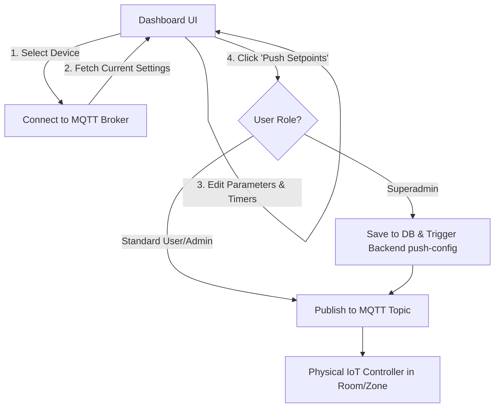

# Office Control Settings Dashboard User Manual

This manual explains how to use the **Office Control Settings** dashboard. It covers selecting a device, understanding room-wise settings, configuring core limits (EC, pH, Temperature, Humidity), setting up standard and Day/Night cyclic timers, and syncing settings to physical IoT devices.

---

## 1. Overview of the Dashboard
The Office Control Settings dashboard allows administrators to manage and push control configurations (setpoints) to IoT-enabled climate and fertigation systems. It communicates with physical controller hardware in real-time using the **MQTT protocol**.

### Key Workflow

---

## 2. Device Selection & Connection Status

### Selecting a Device
1. Locate the **Device Dropdown Menu** in the top right header (labeled with a server icon `Server`).
2. Click the dropdown to view the list of available Office Control devices.
3. Select a device from the list. The system will automatically attempt to connect to it.

### Renaming a Device
If you need to change the display name of a device:
1. Click the **Edit/Pencil icon** next to the device name.
2. Enter the new name and press **Enter** or click **Save**. This updates the device name in the central database.

### Connection Status Indicators
The connection status is shown in the top right corner:

| Status Text | Icon & Color | Meaning |
| :--- | :--- | :--- |
| **Cloud Connected** | `CheckCircle2` (Green) | Connected to the broker. Ready to read/write settings. |
| **Connecting...** | `RefreshCw` (Spinning, Gray) | Attempting to establish a connection. |
| **Pushing...** | `RefreshCw` (Spinning, Green) | Currently sending new setpoints to the device. |
| **Live Successfully** | `CheckCircle2` (Green) | New setpoints have been successfully received by the device. |
| **Connection Error** | `AlertCircle` (Red) | Failed to connect. Check internet/broker configuration. |

---

## 3. Configuring Rooms (Zones)
The dashboard divides configuration settings into **three separate rooms** (tabs). Select the tab representing the room you wish to configure:
- **Room 1 (Zone 1)**
- **Room 2 (Zone 2)**
- **Room 3 (Zone 3)**

> [!NOTE]
> Rooms 1 and 2 share the same core limits and standard day/night timers, while Room 3 is dedicated to climate control automation with dedicated AC and Humidifier cycles.

---

## 4. Core Limits (Rooms 1 & 2 Only)
These values set the safety and operational thresholds for water chemistry (fertigation) and environment:

| Field Name in UI | Internal Key | Description | Unit |
| :--- | :--- | :--- | :--- |
| **EC Minimum** | `EC MIN` | The lowest allowable nutrient concentration. If the EC drops below this, the device triggers dosing. | mS/cm |
| **EC Maximum** | `EC MAX` | The highest allowable nutrient concentration. Dosing stops if EC exceeds this. | mS/cm |
| **pH Low Limit** | `PH LOW` | The lower pH threshold. Below this, the nutrient solution is too acidic. | pH (0-14) |
| **pH High Limit** | `PH HIGH` | The upper pH threshold. Above this, the solution is too alkaline. | pH (0-14) |
| **Day Temp Min** | `DT Min` | The minimum temperature limit allowed during daylight hours. | °C |
| **Day Temp Max** | `D T Max` | The maximum temperature limit allowed during daylight hours. | °C |
| **Night Temp Min** | `N T Min` | The minimum temperature limit allowed during night hours. | °C |
| **Night Temp Max** | `N T Max` | The maximum temperature limit allowed during night hours. | °C |
| **Room Humidity Min** | `H Min` | The minimum acceptable relative humidity level. | % |
| **Room Humidity Max** | `H Max` | The maximum acceptable relative humidity level. | % |

---

## 5. Timers Configuration
Timers control the cycling of pumps, solenoids, or other auxiliary devices. There are two primary types of timers used in the system:

### A. Standard Cyclic Timers (Timer 1 & Timer 2)
Runs a simple repeating ON/OFF loop within a specified window of the day.

* **Timer Name**: Custom label to identify what is plugged into this timer (e.g., "Main Pump").
* **Start Time (HH:MM)**: The hour and minute the timer starts cycling (e.g., `09:00`).
* **Stop Time (HH:MM)**: The hour and minute the timer stops cycling (e.g., `18:00`).
* **ON Duration (Min)**: Number of minutes the equipment stays active per cycle.
* **OFF Duration (Min)**: Number of minutes the equipment stays inactive before turning back ON.

### B. Day/Night Timers (Timer 3 & Timer 4)
Allows different cycling patterns during the day versus the night to mimic natural plant cycles.

* **Day Settings**:
  * **Start Time / Stop Time**: The daylight window (e.g., `06:00` to `18:00`).
  * **ON/OFF Duration**: The active/inactive intervals during the day.
* **Night Settings**:
  * **Start Time / Stop Time**: The night window (e.g., `18:01` to `05:59`).
  * **ON/OFF Duration**: The active/inactive intervals during the night.

---

## 6. Room 3 Special Climate Control Timers
Room 3 does not configure fertigation limits (EC/pH). Instead, it acts as a climate automation hub, separating timers into **AC Timers** and **Humidifier Timers**:

### AC Timers (AC 1 & AC 2)
Controls cooling equipment based on both time and temperature rules:
* **Day & Night Active Periods**: Set start/stop times and ON/OFF cycle runtimes.
* **Temperature Thresholds**:
  * **Day Temp Max / Min**: The temperature range within which the cooling unit is authorized to run during the day.
  * **Night Temp Max / Min**: The temperature range within which the cooling unit is authorized to run at night.

### Humidifier Timers (HUMI 1 & HUMI 2)
Controls misting or humidifying equipment based on both time and humidity rules:
* **Day & Night Active Periods**: Set start/stop times and ON/OFF cycle runtimes.
* **Humidity Thresholds**:
  * **Day Humi Max / Min**: Allowed relative humidity range during the day.
  * **Night Humi Max / Min**: Allowed relative humidity range during the night.

---

## 7. Saving and Pushing Settings
Once you have modified any settings, they are only stored locally in the browser until you push them to the physical hardware.

### How to Apply Changes
1. Confirm you are on the correct **Room Tab** (Room 1, 2, or 3).
2. Click the **Push Setpoints to Room X** button at the bottom of the page.
3. The connection status indicator will change to `Pushing...`.
4. Once the controller confirms receipt of the settings, the status will show `Live Successfully` (along with a success toast notification).

> [!WARNING]
> If the status changes to `Connection Error` or the notification indicates a failure, verify that the physical device is turned on, connected to the internet, and that the MQTT broker is reachable.

---

## 8. Troubleshooting & IT Administration
For IT personnel troubleshooting device connectivity:

1. **MQTT Broker Details**:
   - Communication is structured on the following topic schema:
     - **Subscription**: `inhydro/{deviceRoot}/room{1-3}/setpoints/current` (Reads current config from device)
     - **Sync Trigger**: `inhydro/{deviceRoot}/room{1-3}/setpoints/request_sync` (Payload `1` triggers device state reports)
     - **Publishing Updates**: `inhydro/{deviceRoot}/room{1-3}/setpoints/update` (Sends updated JSON payloads with the `retain` flag enabled)
2. **Superadmin Credentials Sync**:
   - Superadmins have access to database-level syncing.
   - Saving settings as a Superadmin triggers a database update (`PUT /api/devices/{id}`) containing ThingSpeak credentials and triggers the `push-config` API endpoint on the backend.
   - Superadmins can view and change the **MQTT Port** field at the bottom of the screen.
